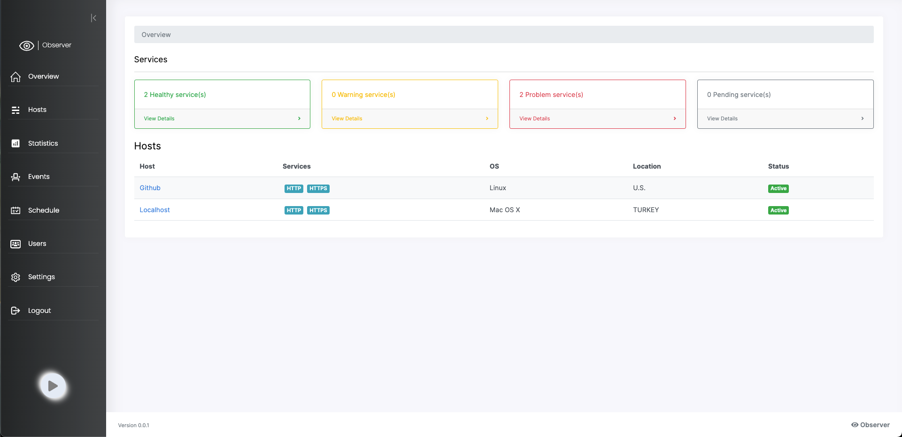
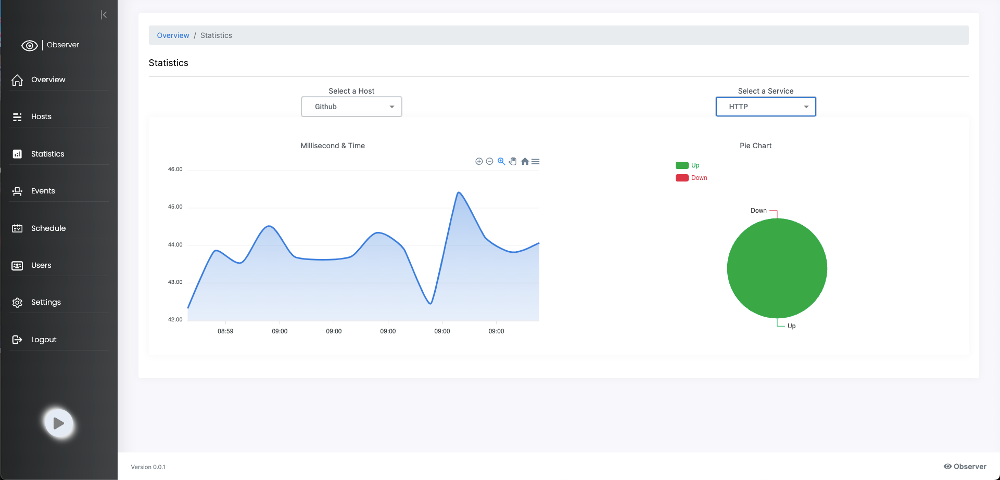

# Monitoring Project - 👁 Observer

## 📖 Table of Contents

- [📝 Description](#-description)
- [📦 Installation](#-installation)
- [🚀 Running the app](#-running-the-app)
- [📚 Packages](#-packages)
- [🗒 Pages](#-pages)
- [📝 Notes](#-notes)
- [📸 Screenshots](#-screenshots)
- [👨‍💻 Author](#-author)

## 📝 Description

This project is a simple monitoring system that uses the Observer to monitor the
status of a server. The server is monitored by a client that sends a request to the server every 5
seconds(time is optional). And mainly content this project is a WebSocket server that receives
the request from the client and sends the response to the client.

## 📦 Installation

```bash
$ git clone https://github.com/alicanli1995/monitoring-react-project.git
$ cd monitoring-react-project
$ npm install 
```

## 🚀 Running the app

```bash
$ npm run start
```

## 📚 Packages

- [x] [emotion/react](http://emotion.sh/docs/introduction)
- [x] [fortawesome](https://fontawesome.com/)
- [x] [react-router-dom](https://reactrouter.com/web/guides/quick-start)
- [x] [react-toastify](https://fkhadra.github.io/react-toastify/introduction)
- [x] [pusher-js](https://pusher.com/docs/channels/getting_started/javascript)
- [x] [sweetalert2](https://sweetalert2.github.io/)
- [x] [axios](http://axios-http.com/docs/intro)
- [x] [react](https://reactjs.org/docs/getting-started.html)
- [x] [react-dom](https://reactjs.org/docs/react-dom.html)
- [x] [reactstrap](https://reactstrap.github.io/)

## 🗒 Pages

- [Overview](http://localhost:3000/) - The home page of the application.
- [Login](http://localhost:3000/login) - The login page of the application.
- [Hosts](http://localhost:3000/hosts) - All hosts page of the application.
- [Host](http://localhost:3000/hosts/:id) - Host page of the application.
- [Statistics](http://localhost:3000/statistics) - Statistics page of the application.
- [Events](http://localhost:3000/events) - Events page of the application.
- [Schedule](http://localhost:3000/schedule) - Schedule page of the application.
- [Users](http://localhost:3000/users) - Users page of the application.
- [Settings](http://localhost:3000/settings) - Settings page of the application.

## 📝 Notes

* Overview -> Page is a general page that shows the status of the hosts and the counts of the
  host health status, like how many hosts are up, down, and in maintenance.
  This page has a specific websocket channel
  that listens to the host status changes and updates the UI in real-time.

* Login -> Page is a login page that has a simple login form. The login form has a validation

* Hosts -> Page is a page that shows all hosts in a table.

* Host -> Page is a page that shows the host details. This page has a specific websocket channel
  that listens to the host status changes and updates the UI in real-time. And you can manage your
  host and adding or removing the host services like HTTP, HTTPS, TLS.

* Statistics -> Page is a page that shows the statistics graph of the hosts.
  This page has a
  specific websocket channel that listens to the host status changes and updates the UI in
  real-time.
  And you can filter the statistics graph by the host and the host services.

* Events -> Page is a page that shows the events of the hosts.

* Schedule -> Page is a page that shows the schedule of the hosts. The schedule is a simple
  cron job that runs every X seconds and sends a request to the server. This page has a specific
  websocket channel
  that listens to the host status changes and updates the UI in real-time.

* Users -> Page is a page that shows the users of the application. You can add, edit users.

* Settings -> Page is a page that shows the settings of the application. You can change the
  application URL, notification setting like what's the notification type for the host status
  changes like SMS or Email.

## 📸 Screenshots

- Overview
  

- Login
  

- Hosts
  

- Host
  

- Statistics
  

- Events
  

- Schedule
  

- Users
  

- Settings
  


## 👨‍💻 Author

* 🇹🇷 [Ali CANLI](https://www.linkedin.com/in/ali-canli/)

